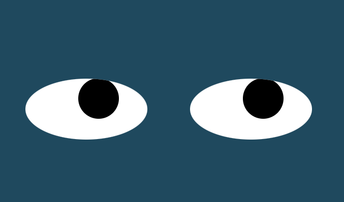
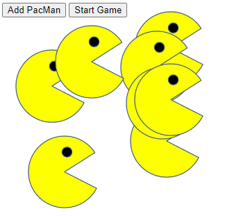

# Oded Maman's GitHub Portfolio

Welcome to my GitHub portfolio! Here you'll find a collection of projects that showcase my passion for technology and automation.

## Projects

### 1. Eyes Exercise

**Overview:**
The Eyes Exercise is a simple web page featuring two eyes that dynamically follow the movement of the user's mouse. This project is a JavaScript and CSS implementation, providing an engaging and interactive user experience.

**GitHub Repository:**
[Odedmmn/Eyes_Exercise](https://github.com/Odedmmn/odedmmn.github.io-Eyes_Exercise)

### 2. Pacman Factory

**Overview:**
Pacman Factory is a responsive web page featuring an interactive PacMan animation triggered by a button click. The project utilizes array methods and advanced DOM manipulation techniques, seamlessly combining functionality and user engagement.

**GitHub Repository:**
[Odedmmn/PacmanFactory](https://github.com/Odedmmn/odedmmn.github.io-PacManFactory)

### 3. Bus Tracker

**Overview:**
The Bus Tracker project leverages the Mapbox API to retrieve real-time data from Boston MBTA buses. The implementation involves fetching live data and displaying the current locations of buses on a map between MIT and Harvard.

**GitHub Repository:**
[Odedmmn/Bus_Tracker](https://github.com/Odedmmn/odedmmn.github.io-Bus_Tracker)

## About Me

Hello, I'm Oded Maman, a robotic engineer and the owner of Sydnah Automation. Our company specializes in developing automation solutions for fabrication shops. My work primarily involves coding, and I'm currently enrolled in the MITxpro Full Stack coding course as part of my ongoing learning and self-improvement journey. I'm passionate about technology and automation, and I'm excited about the potential these projects have to enhance my skills and contribute to our work in robotic integration.

Feel free to explore the individual project repositories for more details!

## License

These projects are licensed under the [MIT License](LICENSE)
